# THE HIKERS

The name of the group The Hikers was created by a group of friends whose passion is hiking.
This is a fictional project created for education purposes only.
## Table of contents

- [Overview](#overview)
- [User stories](#user-stories)
- [UX](#ux)
- [Features](#features)
- [Technologies used](#technologies-used)
- [Resources](#resources)
- [Testing](#testing)
- [Code validity](#code-validity)
- [Version Control](#version-control)
- [Deployment](#deployment)
- [Credits](#credits)
- [Acknowledgments](#acknowledgments)

## Demo
---
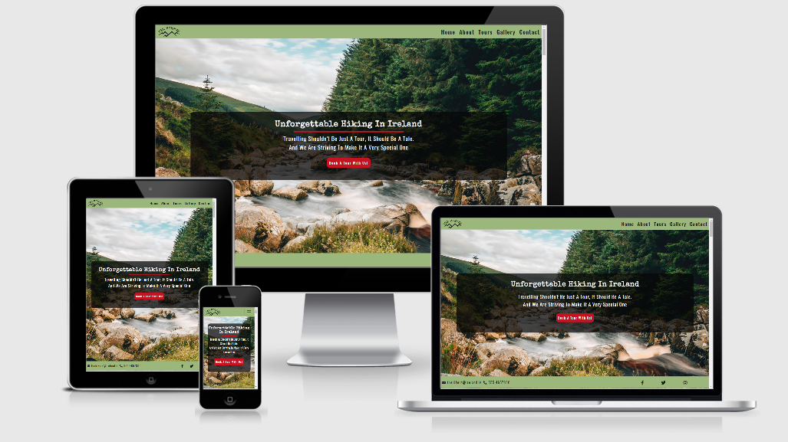
A live demo can be found [here](https://eva-kuk.github.io/The-Hikers-MS1/)

## Overview
---
 - This is my first Milestone 1 project which is part of the Code Institute’s FullStack Software Development Diploma Course. This project demonstrates the skills and knowledge of the HTML, CSS, Bootstrap 4 and User Centric Frontend Development modules which I have learned recently on the course. 
 - The aim of this website is to promote The Hikers group on the market, make the group recognizable and to present their offer of organized trips in the Irish mountains for people looking for adventure, unforgettable experiences, interested in discovering Irish mountain trails, spending time actively.
---

## User stories
1. As a user, I want to navigate the site easily, so that I can find what I need  effectively.
2. As a site visitor, I want to search for an interesting options for tours in Ireland, so I can decide if I am interested in buying one.
3. As a user I want to be able to contact the site owner so I can get more information about their offer options.
4. As an interested and potential customer, I want to follow the site owner on social media, so that I can keep up to date with its upcoming tours.
5. As an interested customer I want to see some visual examples from previous site owner tours, so I can see what to expect.
6. As a user I want to easily understand the purpose of their site.
----
## UX

This website design will target people of all ages, families and friends living in Ireland as well as those who intend to visit Ireland, potentially who like hiking and who are looking for information on the internet about hiking in Ireland.
The purpose of this project is generally simple but effective. It encompasses an eye catching website presenting beautiful, amazing and unforgettable views, which prioritizes direct contact and links to social media.

---

**1. Strategy**

My goal in this project is to promote the group THE HIKERS on the market and increase interest in the tours they offer and grow their business by providing the UX simple, clean and user-friendly. 

### Business goals:
- Promote the new group on the market
- Demonstrate examples of tours to show customers what they can expect
- Increase the number of followers on social media
- Encourage to spend time actively and discover beautiful Ireland

### Customer Goals:
- Easy to read information About Us, eye-catching pictures encouraging customers to  take advantage of the offer long enough to understand the content but not to overwhelm.
- Easy to find contact details to ask questions about a trip
- Easy to find links to social media accounts to follow the group
- Design in mind for mobile devices first as this is recently the most common way of searching for information
- Fixed navigation bar providing user easy navigation reference.
- Fixed footer providing quick reference to Social Media links.

**2. Scope**

I chose the MVP (Minimal Viable Product) approach which:
- Provides users with pure UX
- Includes mobile-first website that is responsive on all devices.
- Fits with my current skills.
- Defines content quickly and focuses on contacting via email or social media. 

**3. Structure**
- The purpose of the Structure has been created as a single page website containing sections separated by captivating pictures using a parallax effect to encourage and attract the visitor's interest and  to enable users to quickly navigate through the website, easily assimilate information and have an overview of the trips to show what customers can expect.
- Contact details have been placed in different parts of the website (footer, contact form, main page button, tours section) for easy access by the user and are provided via e-mail, phone number and links to social media. 
- I initially decided to put the Gallery site separately to facilitate faster page loading due to the large number of images. However, after careful consideration of customers scrolling habits and feedback from the peer-code community I instead decided to include the Gallery as part of one scrollable, single-page website. This allows for easier navitgation and avoids code duplication. 
- A form will be added to the contact page with the following fields: "Full Name", "Email Address", "Tours Available" and "Subject" which are options to select. "Full Name", "Email Address" will be required in order to submit the form, "Email" input must be the valid format. User is alerted of correct input if data is invalid.

**4. Skeleton**

## Wireframe mockups:

- [Home](assets/wireframes/home-page-initial.png)
- [About](assets/wireframes/about-page-initial.png)
- [Tours](assets/wireframes/tours-page-initial.png)
- [Gallery](assets/wireframes/gallery-page-initial.png)
- [Contact](assets/wireframes/contact-page-initial.png)

- Pages/Section: Home, About, Tours, Gallery, Contact
- Gallery in a separated page (was changed through project development)
- Fixed navigation bar - Menu headings and pointing to each of the 5 Pages
- Fixed footer with Contact email-link and phone number and Social Media icons, which will be opened in a new tab.

**Wireframes have changed througt project  development:**

**HOME PAGE**

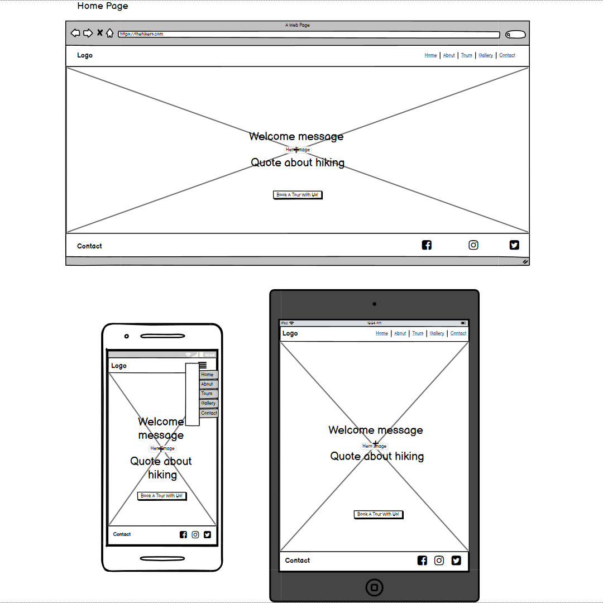

**ABOUT PAGE**

**TOURS PAGE**

**GALLERY PAGE**

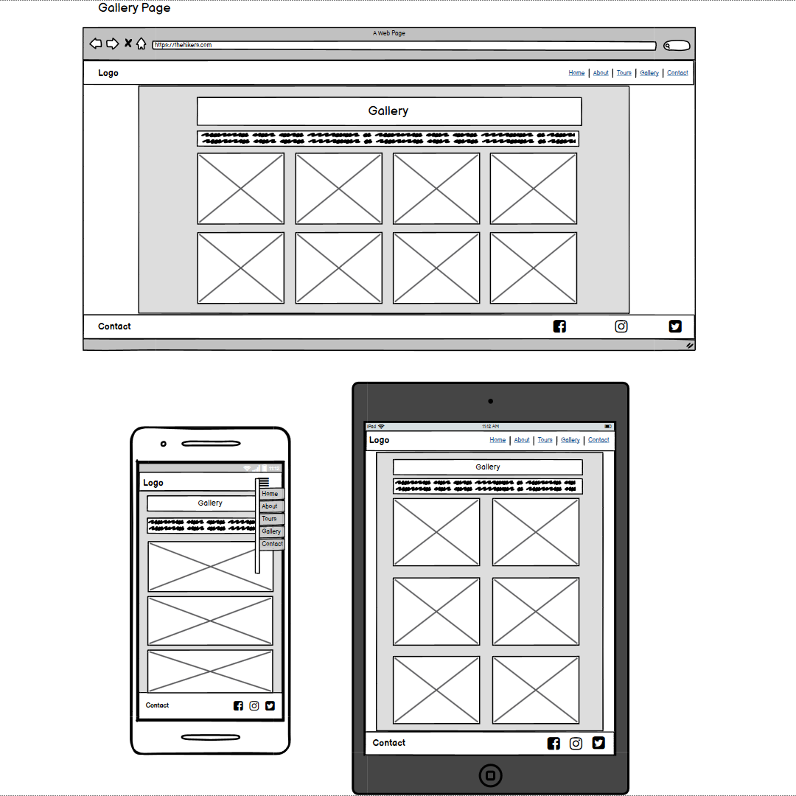

**CONTACT PAGE**

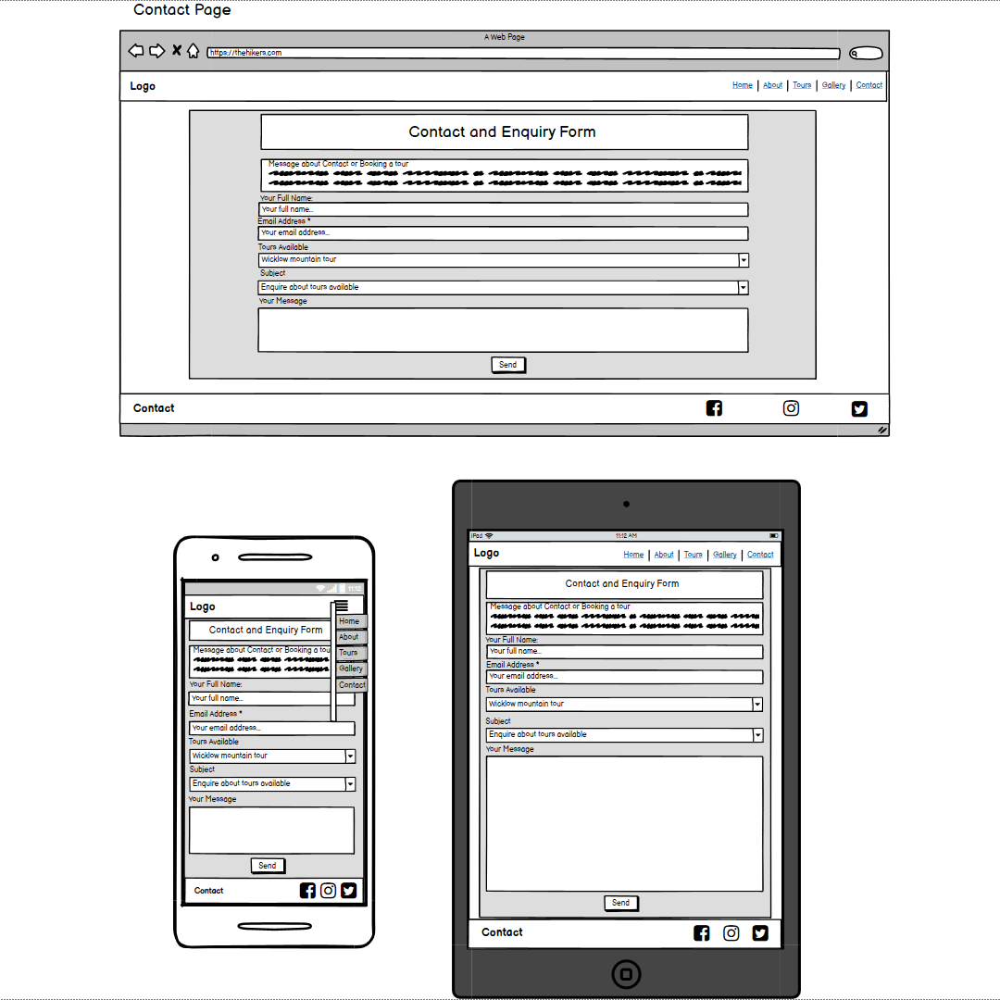
---
**5. Surface**

 **Colors**
- As a primary color, I have chosen the color green (#6cd22d) that is not only associated with Ireland, but also suggests freshness, nature and green landscapes. They will also match the images I have selected for the site. 
- As an additional color, I chose red (#dd3044) which I picked with the color picker from the image with skirts. That color will compliment green and make the important things like contact/sent buttons pop, so it will
 be noticed by the user immediately. The choice was made by reading this article [web builder expert](https://www.websitebuilderexpert.com/designing-websites/how-to-choose-color-for-your-website/).
 - For the other colors I have chosen a combination of dark grey and off-white, which are the darker and lighter shades of primary green color to give a website a balanced contrast: 
 background color (#2d2d2a), body-text color (#fbfbfb), headings (#fbfbfb) and (#2d2d2a).
 
 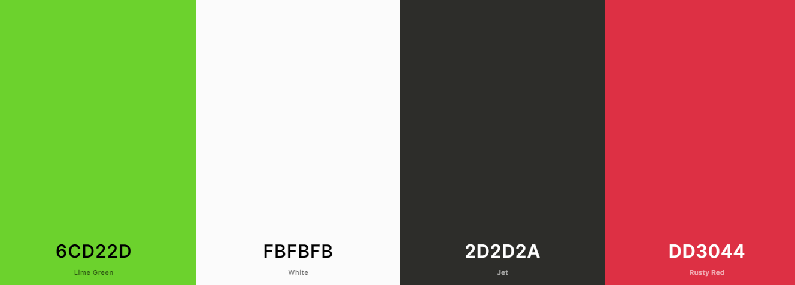

 Taking into account feedback on the peer-code-review, I've decided to tone down the original bright green color
 to a more neutral, to fit to scheme of the website. For the background I've chosen shades of grey, for the text off-white which  I feel well complement the array of colors in the website.
 
 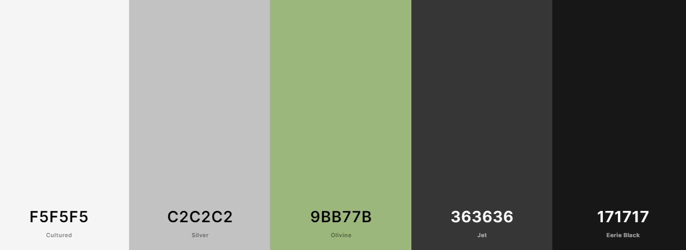

 **Typography**
 
- For the main headings, I selected the same font that was used in The Hikers logo which is the 'Special Elite' with the group of fall-back font of 'Cursive'
- For the content I've chosen 'Oswald' font with fall-back font of 'Sans-Serif', which is a popular pairing font with 'Special Elite' according to [google fonts](https://fonts.google.com/)

 **Images**

- The image selection has been chosen very carefully to charm users of the website with the beauty of Ireland and encourage to participate in offered trips
- The hero image (View of Wicklow landscape) and background images (forest and happy-girl) and for tours section were downloaded from the Pexels and Pixaby. I have chosen a group of selected images for the About Section and the Gallery.
- Video movies from the trips are from the youtube platform for better quality, showing an example of tours, which customers can participate in and exemplifying wonders of Ireland
---
## Features

**Existing Features**
- Designed with HTML5, CSS and Bootstrap.
- One page with 5 sections acting as individual pages.
- Fixed navigation allows user to easily navigate, regardless of which page visited, .
- Fixed footer allows the user to easily access to social media links and contact details like email and phone number. 
  Footer is moved to the bottom of the page on small devices and landcsapes to allow user have a bigger surface.
- Fixed, stacked images for mobile views.
- Home page and Contact And Enquiry Form includes buttons.
- The About page contains an embedded Google map of Ireland.
- Tours page and contact have additional Contact Us and phone options.
- Tours page contains short youtube movies presenting selected tours which can be seen in full screen.
- In Gallery page each picture has been made as modal, allows the user to see images in a larger size.
- Each Section is separated by the background image relating to the theme of the website.

**HOME PAGE**
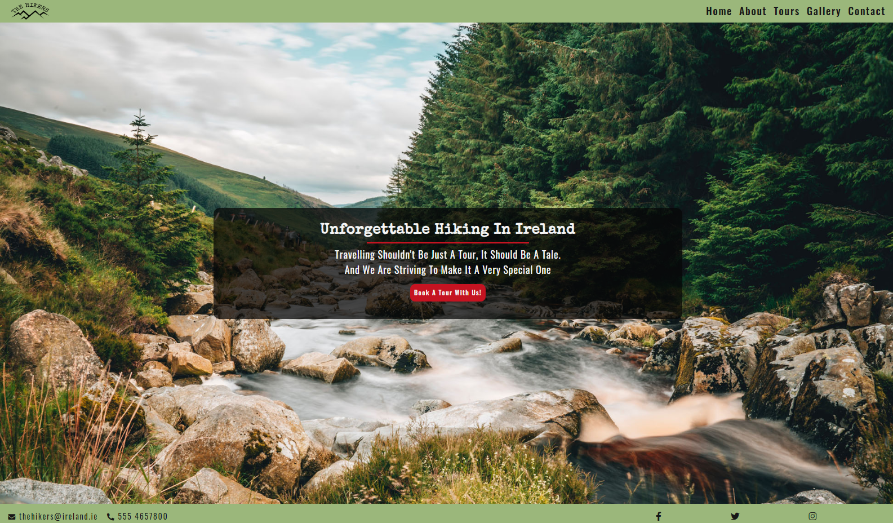

**ABOUT PAGE**
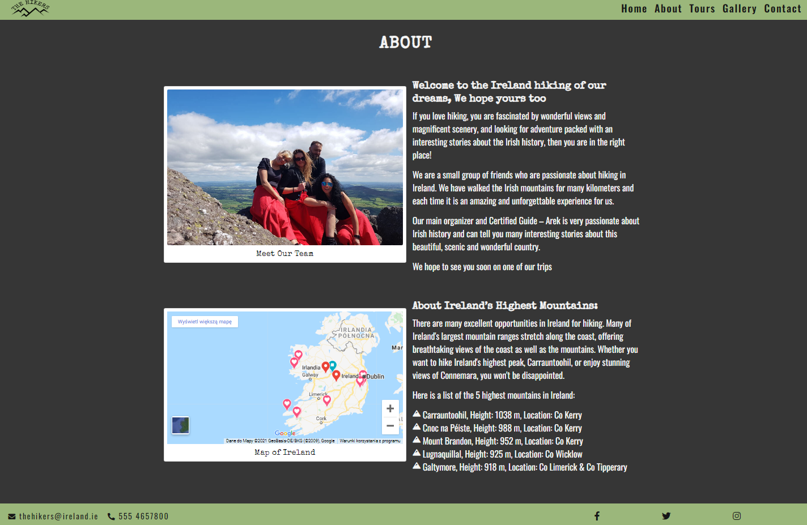

**Background image "Forrest"**
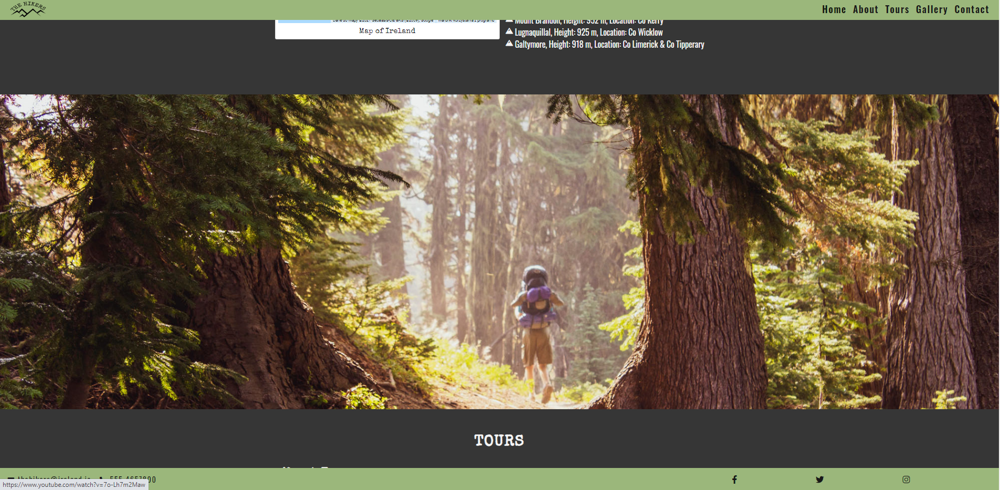

**TOURS PAGE**
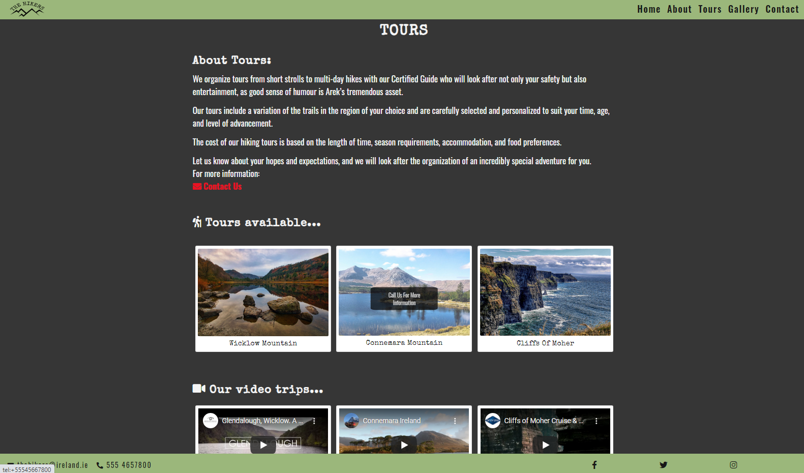

**Background images "Shoes"**
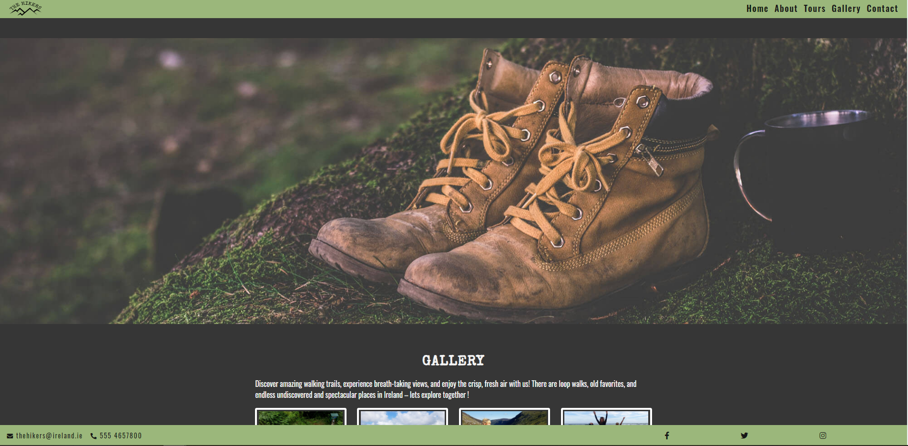

**GALLERY PAGE**
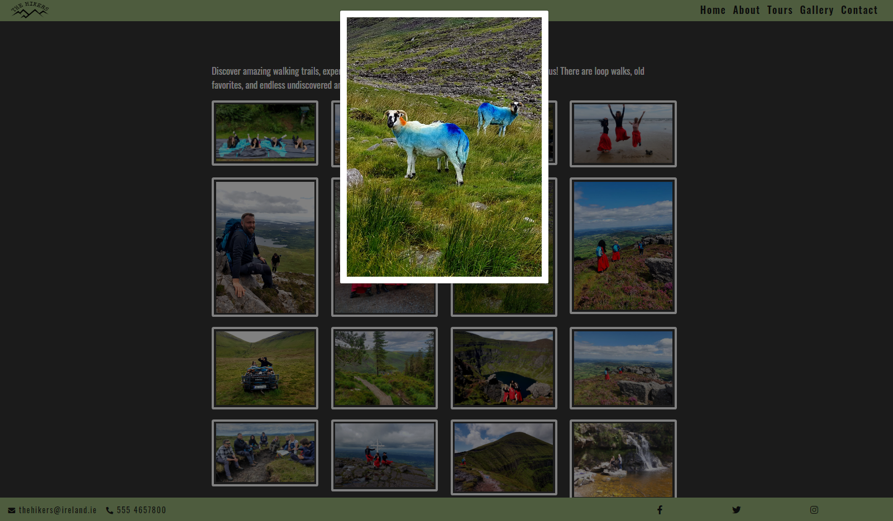

**Background image "Happy-girl"**
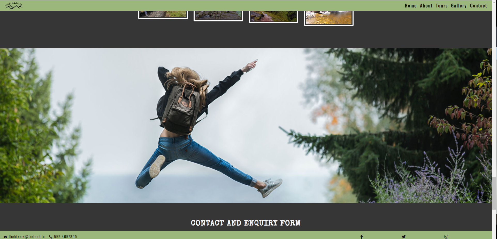

**CONTACT PAGE**
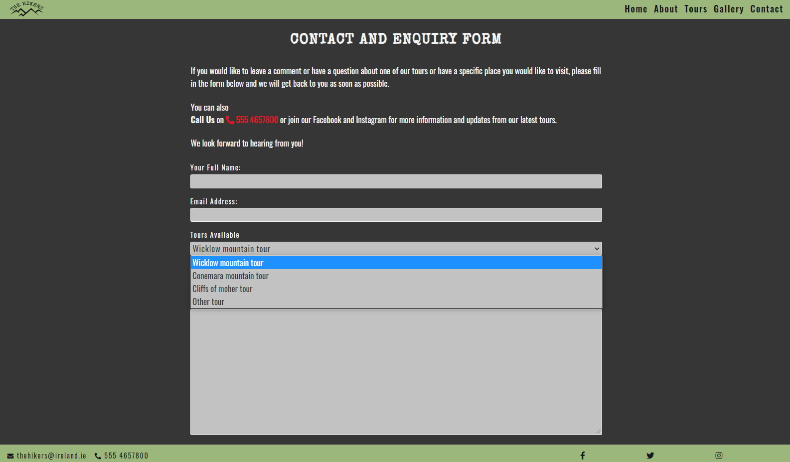

**Features Left to Implement when skills develop**

Another feature idea
- To hide sticky navbar and footer on scroll on small devices and on landscape using javascript.
- The "Sent" button contact form need to be functional so the details can be sent to the server via php.
- Change short videos of excursions on the organized group trips, which today were implemented from youtube.
- More comprehensive Tours section, write more about tours option, and more detailed.
- Integration of Social media Page to have a live update feed of planned trips and events.
- Implement slower scrolling from one page to another using javascript.
---

## Technologies Used

**1. Languages**
- [HTML5](https://en.wikipedia.org/wiki/HTML5) - the current standard that is used
- [CSS3](https://en.wikipedia.org/wiki/CSS) - the current standard that is used

**2. Integrations**
- [Bootstrap 4.5.2](https://getbootstrap.com/) - by linking via Bootstrap CDN to HTML Doc making the design responsive. 
- [Font Awesome](https://fontawesome.com/) - Icons for Social Media links in Footer and Tours section
- [Google Fonts](https://fonts.google.com/) - to import typography of the website into the stylesheet file.

**3. Workspace, version control and Repository storage**
- [GitPod](https://github.com/mkuti/corklagos-venture/blob/master/gitpod.io)- Main workspace IDE (Integrated Development Environment)
- [Git](https://git-scm.com/) - Distributed Version Control tool to store versions of files and track changes.
- [GitHub](https://github.com/) - A cloud-based hosting service to manage my Git repositories.

**4. Other**
- [Photoshop](https://www.photoshop.com/en) - for photo editing

**5. IDE Extensions used in GitPod**
- Auto Close Tag
- Bootstrap 4 CDN Snippet
- Prettier - Code Formatter
- Bracket Pair Colorizer
- Code spell Checker
- FontAwesome Auto-complete

---
## Resources
- [Code Institute Course Content](https://courses.codeinstitute.net/login) -Main source of fundamental knowledge.
- Code Institute SLACK Community - Source of assistance
- [youtube](https://www.youtube.com/) - General resource, add videos.
- [Stack Overflow](https://stackoverflow.com/) -General resource.
- [CSS-Tricks](https://css-tricks.com/)-General resource.
- [w3schools](https://www.w3schools.com/default.asp)-General resource.
- [CommonMark](https://commonmark.org/) - For Markdown language reference.
- [FlexBox Froggy Game ](http://flexboxfroggy.com/) - Learning platform for FlexBox.
- [css-diner.netlify](https://css-diner.netlify.app/#) - Learning platform for type selectors
- [Kurs html](https://www.kurshtml.edu.pl/index.html) - Polish learning web with courses CSS and HTML
- [Pasja informatyki](https://pasja-informatyki.pl/) - Polish learning website
- [TinyPNG](https://tinypng.com/) - Efficient compression of images for site.
- [Am I Responsive](http://ami.responsivedesign.is/) - Responsive website mockup image generator.
- [Responsinator](http://www.responsinator.com/) - Responsive website mockup image generator.
- [Balsamic](https://balsamiq.com/wireframes/) - Wireframing design tool to create wireframes.
- [Bootstrap Grid Explanation by Anna Greaves ](https://ajgreaves.github.io/bootstrap-grid-demo/) - This was an invaluable resource for me to wrap my head around Grid layouts.
- [Free logo design](https://www.freelogodesign.org/ ) Logo design tool
- [WebBbuilder Expert](https://www.websitebuilderexpert.com/designing-websites/how-to-choose-color-for-your-website/) -to choose colors for web
- [Css Variables](https://www.youtube.com/watch?v=PHO6TBq_auI&ab_channel=KevinPowell) - An introduction to CSS custom properties
- [Boxshadowgenerator](https://html-css-js.com/css/generator/box-shadow/) -  box shadow generator for gallery images
- [Colors](https://coolors.co/) - color schemes generator.
- [Contrasr checker](https://webaim.org/resources/contrastchecker/) -contrast color checker
---
## Testing
- Click [here](TESTING.md) for the full testing process.

Overview
- [Encountered Issues](TESTING.md#encounteredissues)
- [Code Validation](TESTING.md#code-validation)
- [Testing User stories](TESTING.md#testing-user-stories)
- [Testing Functionality](TESTING.md#testing-functionality)
- [Testing Compatibility](TESTING.md#testing-compatibility)
- [Testing Accessibility](TESTING.md#testing-accessibility)
- [Testing Performance](TESTING.md#testing-performance)
- [Further Testing](TESTING.md#further-testing)

---
## Code validity
- HTML - [Markup Validation W3C Service](https://validator.w3.org/)
- CSS - [Jigsaw  Validation W3C Service](https://jigsaw.w3.org/css-validator/)
---

## Version Control

- Used Git for version control.

---

## Deployment

 ### **GitHub Pages**

This project has been deployed on GitHub Page. To deploy it, follow the steps:
- All code was written on Gitpod, an online IDE.
- The code was then pushed to GitHub where it is stored in my [Repository](https://github.com/Eva-Kuk/The-Hikers-MS1).
- At the top of the Repository, click on the "Settings" Button on the menu.
- Scroll down the Settings page and find the "GitHub Pages" Section.
- Under "Source"click on the drop-down, and select the "Master" branch.
- Once selected, this publishes the project to GitHub Pages and displays the site's url.
- There is no difference between the deployed version and the development version.

### **To fork the GitHub Repository**

By forking the GitHub Repository we make a copy of the original repository on our GitHub account to view and/or make changes without
affecting the original repository by using the following steps:
1. Log in to GitHub and locate the [Repository](https://github.com/Eva-Kuk/The-Hikers-MS1).
2. At the top right of the Repository just above the "Settings" Button on the menu, locate and click the "Fork" Button.
3. You should have a copy of the original repository in your GitHub account now.

 ### **To make a Local Clone**

1. Log in GitHub and locate the [Repository](https://github.com/Eva-Kuk/The-Hikers-MS1).
2. At the top of the Repository locate the "Code" dropdown menu.
3. To clone the repository using HTTPS, under "CLONE", make sure "HTTPS" is selected and copy the link then.
4. Open Git Bash.
Change the current working directory to the location where you want the cloned directory to be made.
5. Type `git clone` and past the URL you copied in Step 3.
`$ git clone https://github.com/Eva-Kuk/The-Hikers-MS1`
6. Press Enter and you local clone will be created.

---

## Credits

**Media**
- The Gallery images and for About Section in this project are owned and provided by me. 
- The background images for the parallax effect, as the images for the "Tour" section were selected from a free stock photo libraries  [Pexels](https://www.pexels.com/) and  [Pixabay](https://pixabay.com/).
- The logo was designed by THE HIKERS group and created by me using [Free Logo Design](https://www.freelogodesign.org/).

**Content**
The text for the part about the 10 Irish highest mountains was taken and modified for the website needs from [maps.ie](https://www.maps.ie/mountaineering-map-ireland.htm) and [en.wikipedia.org](https://en.wikipedia.org/wiki/Lists_of_mountains_in_Ireland)
The rest of the text on that website was written by me.

**Code Snippets**
- Template code for navbar and modals in Gallery section using bootstrap classes was taken from [Bootstrap](https://getbootstrap.com/docs/5.0/components/navbar/) and heavily modified to suit the sites needs.
- Solution for Bootstrap collapsing back toggle menu on small devices was from [Stack Overflow - "Orel Eliyahu"](https://stackoverflow.com/questions/36405991/bootstrap-toggle-menu-on-one-page-site-does-not-uncollapse-when-clicked).
- Code idea for cards for tour section used with a permission from [JimLynks MS1 project](https://jimlynx.github.io/CI-MS1-Explore-Ireland/#contact).
- Inspiration/and code for jumbotron and hero image was taken from Whiskey project in Bootstrap from [Code Institute](https://codeinstitute.net/) and modified to suit the sites needs.
- Hover-overlay fade code for a tours images were taken from [w3Schools](https://www.w3schools.com/).
- Code for font awesome icon a list in about section [Font Awesome](https://fontawesome.com/how-to-use/on-the-web/styling/icons-in-a-list).
- Solution for background images `background-attachment: fixed;` for iOS devices from  [Stack Overflow -Nicholas Gooding Rios](https://stackoverflow.com/questions/20443574/fixed-background-image-with-ios7).

## Acknowledgments

I would like to thank:
- My mentor, Aron Sinnott, for his guidance through my journey with MS1 project, lots of great advice and ideas which helped me a lot to improve my project development.
- My tutor Cormac for his big support he offered me, troubleshooting guide, his patience, and every single advice.
- I am very grateful and would like to say a special thanks to the Jim JimLynks for his huge help getting started with the project, and his precious time he offered me, for all his support and great advice.
- Tutor support staff for fantastic support they offered, help me guide to solutions in my project.
- The Slack community of Code Institute for feedback.

