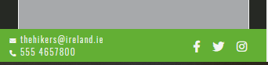
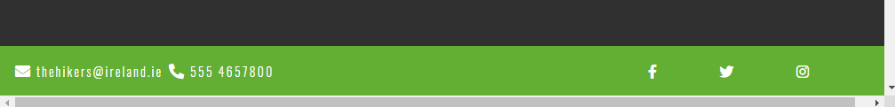
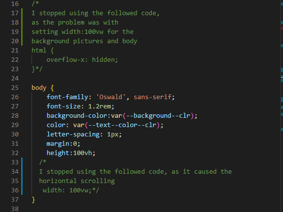
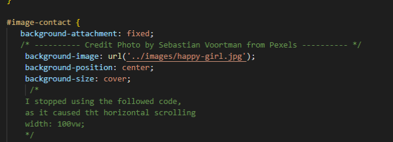
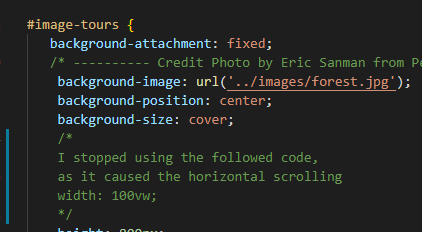

# The Hikers

The name of the group The Hikers was created by a group of friends whose passion is hiking.
This is a fictional project created for education purposes only.
## Table of contents

- [Overview](#overview)
- [User stories](#user-stories)
- [UX](#ux)
- [Features](#features)
- [Technologies used](#technologies-used)
- [Resources](#resources)
- [References for learning](#references-for-learning)
- [Testing](#testing)
- [Project barriers and the solutions](#project-barriers-and-the-solutions)
- [Code validity](#code-validity)
- [Version Control](#version-control)
- [Deployment](#deployment)
- [Credits](#credits)
- [Acknowledgments](#acknowledgments)
- [Support](#support)

## Demo
---
A live demo can be found [here](#)
mockups

## Overview
---
 - This is my first Milestone 1 project which is part of the Code Institute’s FullStack Software Development Diploma Course. This project demonstrates the skills and knowledge of the HTML, CSS, Bootstrap 4 and User Centric Frontend Development modules which I have learned recently on the course. 
 - The aim of this website is to promote The Hikers group on the market, make the group recognizable and to present their offer of organized trips in the Irish mountains for people looking for adventure, unforgettable experiences, interested in discovering Irish mountain trails, spending time actively.
---

## User stories
1. As a user, I want to navigate the site easily so that I can find what I need  effectively
2. As a user visiting Ireland I am searching for an interesting options for trips in Ireland
3. As a user living in Ireland I am looking for interesting ideas for hiking and spending my free time in the mountain
4. As a user I want to know how I can get more information about their offer so I can decide if I am interested in buying a tour
5. As an interested observer and potential client, I want to follow the group on social media and keep up to date with its upcoming tours as well as see the opinions of people who have already participated in the tour.
6. As an interested customer I would like to see some visual examples from previous tours
----
## UX

This website design will target at people of all ages for families and friends living in Ireland as well as those who intend to visit Ireland, potentially who like hiking and who are looking for information on the internet about hiking in Ireland.
The purpose of this project is generally simple but effective eye catching website presenting beautiful, amazing and unforgettable views. The priority is direct contact and links to social media.

---

**1. Strategy**

My goal in this project is to promote the group THE HIKERS on the market and increase interest in the tours they offer and grow their business by providing the UX simple, clean and user-friendly. 

### Business goals:
- Promote the new group on the market
- Demonstrate examples of tours to show customers what they can expect
- Increase the number of followers on social media
- Encouraging to spend time actively and discover beautiful Ireland

### Customer Goals:
- Easy to read information About Us, eye-catching pictures encouraging customers to  take advantage of the offer long enough to understand the content but not to overwhelm.
- Easy to find contact details to ask questions about a trip
- Easy to find links to social media accounts to follow the group
- Design with mobile devices in mind as this is probably the most common way to find information looking for holidays, trips 
- Fixed navigation bar providing user easy navigation reference.
- Fixed footer providing quick reference to Social Media links.

**2. Scope**

I chose the MVP (Minimal Viable Product) approach which:
- It provides users with pure UX
- It includes mobile-first website that is responsive on all devices.
- It fits with my current skills.
- It defines content quickly and focuses on contacting via email or social media. 

**3. Structure**
- The purpose of the Structure has been created as a single page containing sections/pages separated by eye-catching pictures using a parallax effect to encourage and attract the visitor's interest and  to enable users to quickly navigate through the website, easily assimilate information and have overview from of the trips to show what can be expected by buyers on the offered trips.
- Contact details have been placed in different parts of the website (footer, contact form, main page button, tours section) for easy access by the user and are provided via the e-mail, phone number and links to social media. 
- I decided to put the Gallery section separately to facilitate faster page loading due to the large number of photos

**4. Skeleton**

## Wireframe mockups:
- [Home](assets/wireframes/home-page.png)
- [About](assets/wireframes/about-page.png)
- [Tours](assets/wireframes/tours-page.png)
- [Gallery](assets/wireframes/gallery-page.png)
- [Contact](assets/wireframes/contact-page.png)

- Pages/Section: Home, About/Tours, Contact
- Gallery in a separated page (changed through project development)
- Fixed navigation bar - Menu headings and pointing to each of the 4 Pages
- Fixed footer with Contact email-link and phone number and Social Media icons

---
**5. Surface**

 **Colors**
- As a primary color, I have chosen color green (#57ab24) that is not only associated with Ireland, but also suggest freshness, nature and green landscapes. They will also match the photos I have selected for the site. 
- As a additional color I choose a red (#dd3044) which i picked by the color picker from the image with skirts. That color will compliment green and make the important things like contact/sent buttons pop, so it will
 be noticed by the user immediately.
 -For the other colors I have chosen a combination of dark grey nad off-white, which are the darker and lighter shades of primary green colors to give a website a balanced contrast: 
 background color (#2b2d2a), body-text color (#fbfbfb), headings (#fbfbfb) and (#2b2d2a) .

 **Typography**
 
- For the main headings I have chosen the same font that was used in The Hikers logo which is the "Special Elite" with the group of fall-back font of cursive
- For the content I have chosen Oswald font with fall-back font of Sans-Serif, which is popular pairing font with "Special Elite" according to www.fontsgoogle.com 

 **Images**

- The image selection has been chosen very carefully to visually presents to charm users of the website with the beauty of Ireland and encourage to participate in offered trips
The hero image (View of Wicklow landscape) and background images (forest and happy-girl) and for tours section were downloaded from the Pexels and Pixaby. I have chosen a group of selected images for the about section and the gallery.

---
## Features

**Existing Features**
- Designed with HTML5, CSS and Bootstrap.
- One page with 4 sections acting as individual pages and one separate page for the gallery images 
- Fixed navigation allows user to easily navigate, regardless of which page visited.
- Fixed footer allows the user to easily access to social media links and contact details like email and phone number
- Fixed, stacked images for mobile views
- Home page and Contact And Enquiry Form with radio buttons
- Tours page and contact have additional Contact Us  and phone option
- In gallery page each picture has been linked, so that the user can see the image in a larger size

**Features Left to Implement when skills develop**

Another feature idea
- As the owner is originally from Poland to encourage Polish visitors to explore Ireland, it is hoped to add a bilingual option (English & Polish) which will translate the page into the appropriate language.
- The "Sent" button contact form need to be functional so the details can be sent to the server via php
- Change short videos of excursions on the organized group trips, which today were implemented from youtube
- More comprehensive Tours section write more about tours option, and more detailed 
- Integration of Social media Page to have a live update feeds of planned trips and events.
- Improve gallery section maybe by using javascript
---

## Technologies Used

**1. Languages**
- [HTML5](https://en.wikipedia.org/wiki/HTML5) - the current standard that is used
- [CSS3](https://en.wikipedia.org/wiki/CSS) - the current standard that is used

**2. Integrations**
- [Bootstrap 4.5.2](https://getbootstrap.com/) - by linking via Bootstrap CDN to HTML Doc making the design responsive. 
- [Font Awesome](https://fontawesome.com/) - Icons for Social Media links in Footer and Tours section
- [Google Fonts](https://fonts.google.com/) - to import typography of the website into the stylesheet file.

**3. Workspace, version control and Repository storage**
- [GitPod](https://github.com/mkuti/corklagos-venture/blob/master/gitpod.io)- Main workspace IDE (Integrated Development Environment)
- [Git](https://git-scm.com/) - Distributed Version Control tool to store versions of files and track changes.
- [GitHub](https://github.com/) - A cloud-based hosting service to manage my Git repositories.

**4. Other**
- [Photoshop](https://www.photoshop.com/en) - for photo editing

**5. IDE Extensions used in GitPod**
- Auto Close Tag
- Bootstrap 4 CDN Snippet
- Prettier - Code Formatter
- Bracket Pair Colorizer
- Code spell Checker
- FontAwesome Auto-complete

---
## Resources
- [Code Institute Course Content](https://courses.codeinstitute.net/login) -Main source of fundamental knowledge.
- Code Institute SLACK Community - Source of assistance
- [youtube](https://www.youtube.com/) - General resource, add videos.
- [Stack Overflow](https://stackoverflow.com/) -General resource.
- [CSS-Tricks](https://css-tricks.com/)-General resource.
- [w3schools](https://www.w3schools.com/default.asp)-General resource.
- [CommonMark](https://commonmark.org/) - For Markdown language reference.
- [FlexBox Froggy Game ](http://flexboxfroggy.com/) - Learning platform for FlexBox.
- [css-diner.netlify](https://css-diner.netlify.app/#) - Learning platform for type selectors
- [kurshtml](https://www.kurshtml.edu.pl/index.html) - Polish learning web with courses CSS and HTML
- [pasja-informatyki](https://pasja-informatyki.pl/) - Polish learning website
- [TinyPNG](https://tinypng.com/) - Efficient compression of images for site.
- [Am I Responsive](http://ami.responsivedesign.is/) - Responsive website mockup image generator.
- [Balsamic](https://balsamiq.com/wireframes/) - Wireframing design tool to create wireframes.
- [Bootstrap Grid Explanation by Anna Greaves ](https://ajgreaves.github.io/bootstrap-grid-demo/) - This was an invaluable resource for me to wrap my head around Grid layouts.
- [freelogodesign](https://www.freelogodesign.org/ ) Logo design tool
- [webbuilderexpert](https://www.websitebuilderexpert.com/designing-websites/how-to-choose-color-for-your-website/) -to choose colors for web
- [css Variables](https://www.youtube.com/watch?v=PHO6TBq_auI&ab_channel=KevinPowell) - An introduction to CSS custom properties
- [boxshadowgenerator](https://html-css-js.com/css/generator/box-shadow/) -  box shadow generator for gallery images

----

## References for learning

---
## Testing

**Project Bugs And solutions**

During the development of this project, trying to use the combination of Bootstrap, CSS3 and Html5 together was a big challenge for me and I had the impression that my project is one big virus which, after fixing one problem, crashes into another. In general, it seems to me that most of the problems I had were caused by insufficient knowledge of the newly learned programs and tools as well as experimenting with them, and here are some of them:
1. The contact links in the footer did not appeared correctly, after hover over with the mouse they fell apart, after consulting it with tutor assistance, the problem was wrong code in hover in contact-links which I set earlier by mistake. The solution was remove that line of code

    

2. Problem with scrolling horizontal bar that appeared. To get around this after consulting it with the tutor assistance first I gave the html a value overflow:hidden which worked good, but later I found the real reason why the horizontal scrolling appeared. I noticed on the unicorn revealer that my background images were overflowing. 
I set for the both background images and for the whole body width: 100vw; which caused the problem. To solve this I removed the with of the pictures and the body

---

---

----

3. In the Gallery page, the entire content of the page, when resizing the screen, moved to the right edge of the screen and hid behind causing the gap on the left side, the problem was a very large margin which I set for the images for the whole margin.The solution was to remove margin and set margin:top and margin:bottom only.

4. Issue with the fixed top navbar was overlying on the other content and the headings on each section were hidden behind the navbar. After consulting with the tutor assistance the solution for this was set for each section an id="about/tours/contact/gallery" and in stylesheet.css set: border-top:3px solid transparent;
    margin-top: -3px;
    
---
1. As a user, I want to navigate the site easily so that I can find what I need  effectively.
- No matter what page the user lands on, they can easily find and use navigation bar.
- The logo image always leads back to the home page.
- The home page call to action button leads the client to a contact form.

2. As a user visiting Ireland I am searching for an interesting options for trips in Ireland.
- Links clearly labelled  easy to find on the navigation bar leading to Trips page where presented a samples of video showing a beauty Ireland.
- Links clearly labelled  easy to find on the navigation bar leading to Gallery page depict gallery from the past tours.
- A clearly labeled About page easy to find in the navigation bar which contains photos ot the group team an text about the group.

3. As a user living in Ireland I am looking for interesting ideas for hiking and spending my free time in the mountain.
- Links clearly labelled on navigation bar easy to find leading to Trips and Gallery page to show a samples of video images from the trips.
- Clearly labelled easy to find contact and social media links.

4. As a user I want to know how I can get more information about their offer so I can decide if I am interested in buying a tour.
- Contact details are always displayed on the sticky footer easy to find.
- On the home page is call to action button which leads to contact page.
- On the Tours page there is a link which lead to contact page.
- On the Tours page call to action button on each tour lead to contact through the phone number.

5. As an interested observer and potential client, I want to follow the group on social media and keep up to date with its upcoming tours as well as see the opinions of people who have already participated in the tour.
- Clearly labelled social media links displayed on the sticky footer easy to find.

6. As an interested customer I would like to see some visual examples from previous tours
- Links clearly labelled easy to find on the navigation bar leading to Trips and Gallery page to show a samples of video images from the trips.

Validator 
1. Warning: The document is not mappable to XML 1.0 due to two consecutive hyphens in a comment.
- Solution - I removed all hyphens in a comments and left just two.
2. Warning: Section lacks heading. Consider using h2-h6 elements to add identifying heading to all sections.
- Solutions - The error was related to the sections that I set for the background images. I changed the sections to div.
3. Error: The frameborder attribute on the iframe element is obsolete. Use CSS instead.
- Solutions - attribute removed.
4. Error: Bad value 100% for attribute width and height on element iframe: Expected a digit but saw % instead.
- Solution - The attributes for width and height in all iframe elements changed to its previous size. iframe wrapped with div video-wrapper and styled in css for responsive video
1

## Project barriers and the solutions
-
-
-

---

## Code validity

---

## Version Control

-
-
-

---

## Deployment

This project has been deployed on GitHub Pages with the following process:

- All code was written on Gitpod, an online IDE.
- The code was then pushed to GitHub where it is stored in my [Repository](https://github.com/Eva-Kuk/The-Hikers-MS1).
- Under the settings section of the GitHub repository, scroll down to GitHub Pages section.
- Under 'Source' drop-down, the 'Master branch' was selected.
- Once selected, this publishes the project to GitHub Pages and displays the site's url.
- There is no difference between the deployed version and the development version.
- The code can be run locally through clone or download.
- You can do this by opening the repository, clicking on the green 'Code' button and selecting either 'clone or download'.
- The Clone option provides a url, which you can use on your desktop IDE.
- The Download ZIP option provides a link to download a ZIP file which can be unzipped on your local machine.

---

## Credits

**Media**
- The gallery images and for about section in this project are owned and provided by THE HIKERS group. I have permission from people who are in these photos to use them in this project.
- The background images for the parallax effect, as the images for the "Tour" section were selected from a free stock photo libraries  [Pexels](https://www.pexels.com/) and  [Pixabay](https://pixabay.com/)
- The logo was made by THE HIKERS group (myself) using [Free Logo Design](https://www.freelogodesign.org/)

**Content**
The text for the part about the 10 Irish highest mountains was taken and modified for the website needs from [maps.ie](https://www.maps.ie/mountaineering-map-ireland.htm) and [en.wikipedia.org](https://en.wikipedia.org/wiki/Lists_of_mountains_in_Ireland)
The rest of the text on that website was written by me

**Code Snippets**
- Template code for navbar using bootstrap classes was taken from [Bootstrap](https://getbootstrap.com/docs/5.0/components/navbar/)and heavily modified to suit the sites needs.
- Solution for Bootstrap collapsing back toggle menu on small devices was from [Stack Overflow - "Orel Eliyahu"](https://stackoverflow.com/questions/36405991/bootstrap-toggle-menu-on-one-page-site-does-not-uncollapse-when-clicked).
- Code idea for cards for tour section [JimLynks MS1 project](https://jimlynx.github.io/CI-MS1-Explore-Ireland/#contact).
- Inspiration/and code for jumbotron and hero image was taken from Whiskey project in Bootstrap from [Code Institute](https://codeinstitute.net/) and modified to suit the sites needs.
- Hover-overlay fade code for a tours images were taken from [w3Schools](https://www.w3schools.com/).
- Code for font awesome icon a list in about section [Fon Awesome](https://fontawesome.com/how-to-use/on-the-web/styling/icons-in-a-list).

## Acknowledgments

I would like to thank:
- My mentor, Aron Sinnott, for his guidance through my journey with MS1 project, lots of great advices and ideas which helped me a lot to improve my project development
- My tutor Cormac for his big support he offered me, troubleshooting guide, his patience, and every single advice
- I am very grateful and would like to say a special thank to the Jim JimLynks for his huge help getting started the project, and a lot of his free time he offered me, for all his support and great advices,
- Slack Community and Student  Support CI staff for fantastic support they offered, who have helped guide me to solutions in my project.

