# Testing

- [Encountered Issues](#ecountered-issues)
- [Code Validation](#code-validation)
- [Testing User stories](#testing-user-stories)
- [Testing Functionality](#testing-functionality)
- [Testing Compatibility](#testing-compatibility)
- [Testing Accessibility](#testing-accessibility)
- [Testing Performance](#testing-performance)
- [Further Testing](#further-testing)

---
## Encountered Issues
---
**Project Bugs And solutions**

During the development of this project, trying to use a combination of Bootstrap, CSS3 and HTML5 together was a big challenge for me and I had the impression that my project is a one big virus which, after fixing one problem, crashes into another. In general, it seems to me that most of the problems I had were caused by insufficient knowledge of the newly learned programs and tools as well as experimenting with them, and here are some of them:
1. The contact links in the footer did not appear correctly, after hover over with the mouse they fell apart.
The problem was caused by wrong code in `.contact-links a:hover` which I set earlier by mistake. 

    - SOLUTION: removing the line of code which caused the problem

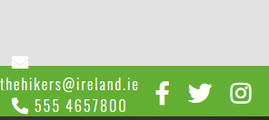 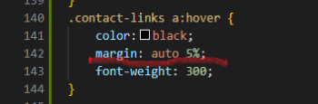  

2. Scrolling horizontal bar appeared. 
    - SOLUTION1: by setting in CSS for html a value `overflow:hidden;` which worked good, but the real reason why the horizontal scrolling appeared was that my background images were overflowing. I noticed that on the unicorn revealer.
    - SOLUTION2: by removing `width: 100vw;` for the body and changing `width: 100vw;` for the both background images to `width:auto;`  

---

---

----

3. In the Gallery page, the entire content of the page, when resizing the screen, moved to the right edge of the screen and hid behind causing the gap on the left side, the problem occured due to a very large margin which I set for the images for the whole margin.
    - SOLUTION:by removing margin and set margin top and bottom only in CSS code: 
    `margin-top: 0.3rem;
    margin-bottom:1.2rem;`

4. Issue with the fixed top navbar was overlying on the other content and the headings on each section were hidden behind the navbar. 
    - SOLUTION: by setting in HTML for each section an id="about/tours/contact/gallery" and in CSS by setting: 
`border-top:3px solid transparent;
margin-top: -3px;`

5. Background hero-image and images for parallax effect didn't resize and didn't look good on smaller devices, 
    - SOLUTION1: by changing `width:100%`, `height:auto` but didn't work as expected,
    - SOLUTION2: by removing `background-attachment: fixed;` but didn't work as expected,
    - SOLUTION3:  by replacing in media queries pictures for smaller devices with new ones with reduced size

------

6. Page sections don't adjust their size with the change of different devices and don't cover the size of the entire screen. The background image is visible at the bottom of the page
    
    - SOLUTION1: by setting the media query `height:` from `auto` to `100vh` first from small to large devices then opposite did not give the expected result, because sometimes the page content was chopped or didn't look nice.
    
    - SOLUTION2: by adding more content to About and Tours page and setting media query which didn't work as well
    `@media screen and (min-width:1650px) {
    #tours {
        height: 100vh;
    }
    #about {
        height: 100vh;
    }
    }`
    - SOLUTION3: by adding div to html about and tours section with `class="about-margin"` and `class="tours-margin"` and setting `margin-bottom: 3.5rem;`

---  
## Code Validation
---
1. used [W3C Markup Validation Service HTML](https://validator.w3.org/) to validate my HTML code for both pages index.html and gallery.html. 
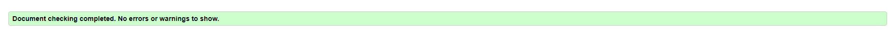

Initially, the validator displayed the errors and warnings as shown below but these have been fixed.

- **Warning:** The document is not mappable to XML 1.0 due to two consecutive hyphens in a comment.
    - Fixed - by removing all hyphens in a comments and left just two.
- **Warning:** Section lacks heading. Consider using h2-h6 elements to add identifying heading to all sections.
    - Fixed - The errors were related to the sections that I set for the background images. 
    Fixed by changing the name sections to div.
- **Error:** The frameborder attribute on the iframe elements is obsolete. Use CSS instead.
    - Fixed - by removing attribute.
- **Error:** Bad value 100% for attribute width and height on element iframe: Expected a digit but saw % instead.
    - Fixed - by changing the attributes width:100% and height:100% which I set before in all iframe elements
     to its previous size. iframe wrapped with div video-wrapper and styled in CSS for responsive video
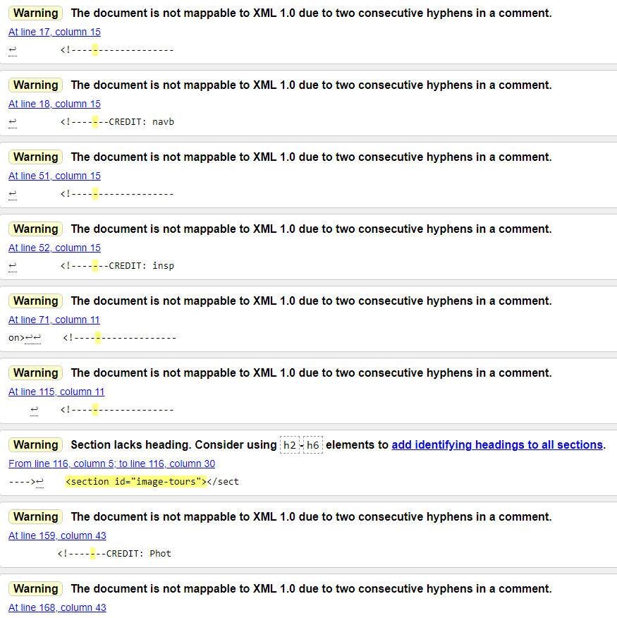

**ADITIONAL TESTING through the project development**

After changes I've made in the project, considering advice from other users and from 
the peer-code-review, the website was tested again, the errors that displayed were corrected.
- **Error:** The `aria-labelledby` attribute must point to an element in the same document, displayed 16 errors.
    - Fixed - by changing in all images `aria-labelledby="girls-in-the-forestModalLabel` to the same like
    in `id="girls-in-the-forestModal"` and so on

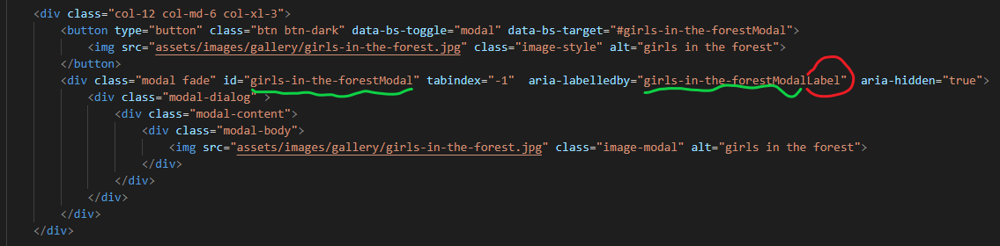
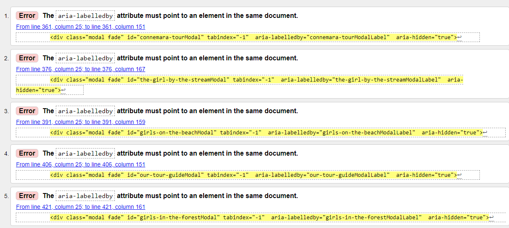

2. used [jigsaw W3C CSS Validation Service](https://jigsaw.w3.org/css-validator//) to validate my CSS code, came out  clean  but showed 38 warnings related to Variables values and autoprefixer vendor extensions
- warnings related to Variables values, research on the internet and found this is a non-issue after reading reports on [Stack Overflow](https://stackoverflow.com/questions/57661659/w3c-css-validation-parse-error-on-variables).
It is also requested feature on [Github](https://github.com/w3c/css-validator/issues/111) too.
- warnings related to unknown vendor extension i found thai is also non-issue after reading about it on different sources [Stack Overflow](https://stackoverflow.com/questions/52490004/what-are-all-of-these-w3c-css-validation-warnings-about)

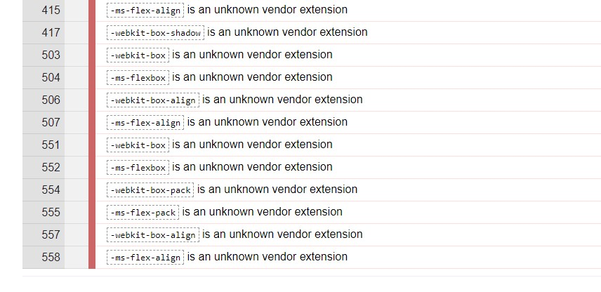

**ADITIONAL TESTING through the project development**

After changes I've made in the project, considering advice from other users and from 
the peer-code-review, the website was tested again, the errors that displayed were corrected.
- **Error:** Value Error: border-width `none` is not a `border-width` value `none`
    - Fixed - by changing a value border to `border-width:0px;`
- **Error:** The `aria-labelledby` attribute must point to an element in the same document, displayed 16 errors.
    - Fixed - by changing in all images `aria-labelledby="girls-in-the-forestModalLabel` to the same like
    in `id="girls-in-the-forestModal"` and so on

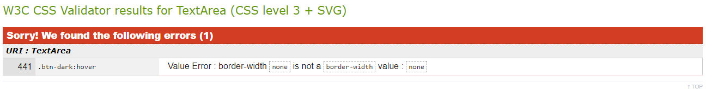

---
## Testing User stories
---
1. As a user, I want to navigate the site easily so that I can find what I need  effectively.
    - No matter what page the user lands on, they can easily find and use navigation bar which also  is set fixed, being available all times.
    - The logo image always leads back to the home page.
    - The home page call to action button leads the client to a contact form.

    

2. As a site visitor, I want to search for interesting options for tours in Ireland, so I can decide if I am interested in buying one.
    - Links clearly labelled  easy to find on the navigation bar leading to Trips page where presented a samples of video.
    - Links clearly labelled  easy to find on the navigation bar leading to Gallery page depict gallery from the past tours.
    - A clearly labelled About page easy to find in the navigation bar which contains a note about the group, some information about Irish mountains and map of Ireland.
    
    
    ---
    
    ---
    

3. As a user I want to be able to contact the site owner so I can get more information about their offer options.
    - Contact details are always displayed on the sticky footer easy to find.
    - On the home page is call to action button which leads to contact page.
    - On the Tours page there is a link which lead to contact page.
    - On the Tours page call to action button on each tour lead to contact through the phone number.
     
    

4. As an interested and potential customer, I want to follow the site owner on social media, so that I can keep up to date with its upcoming tours.
    - Clearly labelled social media links displayed on the sticky footer easy to find.
      
    
     
5. As an interested customer I want to see some visual examples from previous site owner tours, so I can see what to expect.
    - Link clearly labelled easy to find on the navigation bar leading to Trips site showing a sample of videos from the trips which can be open in full screen.
    - Link clearly labelled easy to find on the navigation bar leading to Gallery site showing a sample offer images from the trips.
     
     

6. As a user I want to easily understand the purpose of your site.
    - When user lands on the website the jumbotron welcome sign describes the website's purpose 
    
     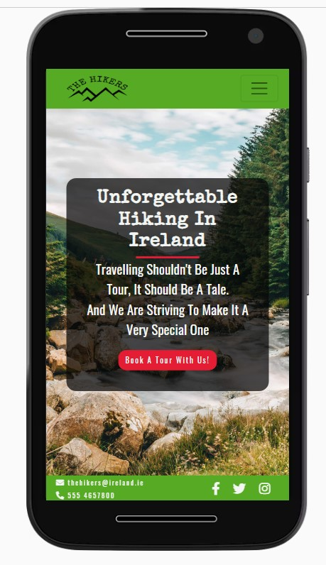

---
## Testing Functionality
---
### Checking for broken links

1.  Expected: All menu links, including logo brand is expected to be functional and navigate to relevant sections when used (logo links to home page)
    - Testing: Tested all navigation links by clicking every link and buttons several times from different devices, browsers moving from one link to another from left to right
    - Result: The site acted as expected navigation bar links are functional, including logo brand menu links navigate to the relevant section

2. Expected: Contact and Enquiry form performs as expected to perform accurately when user puts correct, no data or wrong data
    - Testing: Tested the form by putting first correct data to each field, then wrong data and then no data in the required field
    - Result: The site did not respond with a warning message, if the wrong email format was inputted. The rest of the fields performed as expected. Name or surname can be added to "Enter your fill name" field with no warning which is correct
    - Fix I changed `type="text"` to `type="email"` in the followed code 

3. Expected: All social links, email, phone number contact links is expected to open in new tab and navigate to the relevant places
    - Testing: Tested every link separately by clicking each link
    - Result: All links acted as expected

4. Expected: The button on the home page "Book A Tour With Us!" and link "Contact Us" on Tours site leads to Contact and enquiry form site   
    - Testing: Tested every button separately by clicking  links
    - Result: Both link and button acted as expected

5. Expected: All images in gallery site and about site opens in a new window   
    - Testing: Tested every image separately by clicking at each image
    - Result: all images links acted as expected

6. Expected: Embedded video links open in small and full screen
    - Testing: Tested every video separately by clicking at each video
    - Result: All video links acted as expected
---
### Responsive Design
---
- The website has been tested by using [Chrome DevTools](https://developers.google.com/web/tools/chrome-devtools) and also on [Am I Responsive](http://ami.responsivedesign.is/)
    and [Responsinator](http://www.responsinator.com/) on a number of devices with varying screen dimensions, 
    for both portraits and landscape including iPhone 5/SE, iPhone 6/7/8, iPhone 6/7/8 plus, iPhone 11, iPad, iPad Pro, Moto G4, Galaxy S5, Surface Duo,
    Galaxy Fold, Widescreen Laptop and Desktop PC, iPad landscape · width: 1024px,  iPhone 6-8 Plump landscape · width: 736px ,iPhone 6-8 landscape · width: 667px, Android (Pixel 2) landscape · width: 684px, iPhone eXpensive landscape · width: 734px
    The following issue was detected and fixed during mobile compatibility testing:
    Background images on smaller devices and landscape needs to be set in media queries, footer on landscape devises set thinner.  
- The website was also tested on real devices both portrait and landscape. The result on the other browsers was satisfying acept ios devices :
    - Samung Galaxy S6/S7/S8/S10
    - iPad Air
    - iphone 7
    - BlackBerry phone
    - Samgung Galaxy Tablet

 **Encountered problems while testing the site on different devices**
- Pages scroll too fast.
- Background images which is set as `background attachment: fixed` don't render properly on macOS devices.
    - SOLUTION: I found the solution on
    [stack overflow](https://stackoverflow.com/questions/20443574/fixed-background-image-with-ios7) and applied a new code to background images.
---
## Testing Compatibility
---
- The website was tested on the following browsers and operating systems:
    - Google Chrome (Windows 10, Android 11, Linux).
    - Microsoft Edge (Windows 10).
    - Safari.
    - Firefox (Windows 10).
    - Opera (Windows 10, Linux).

    Background photos dind't render properly on macOS devices. The result on the other browsers was satisfying.
    - SOLUTION: I found the solution on
    [stack overflow](https://stackoverflow.com/questions/20443574/fixed-background-image-with-ios7) and applied a new code to background images.
   

   - Test for Opera browser
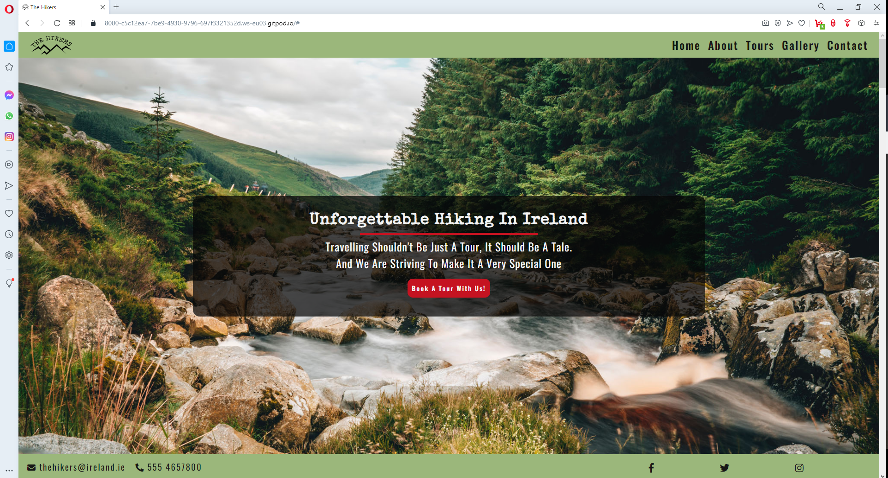

   - Test for Firefox browser
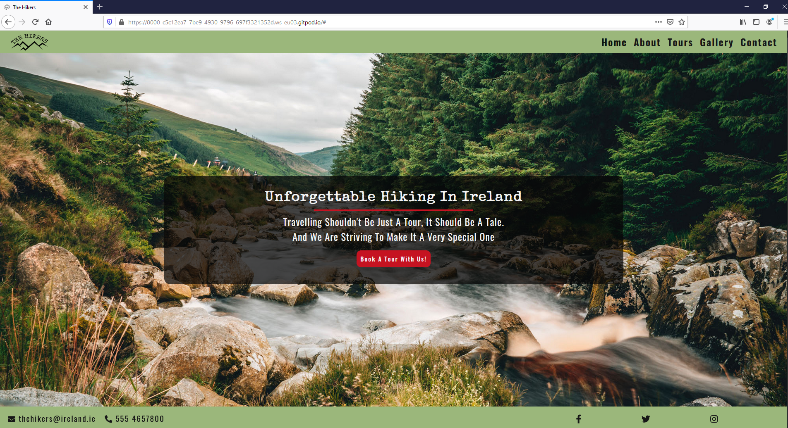

   - Test for Microsoft Edge browser
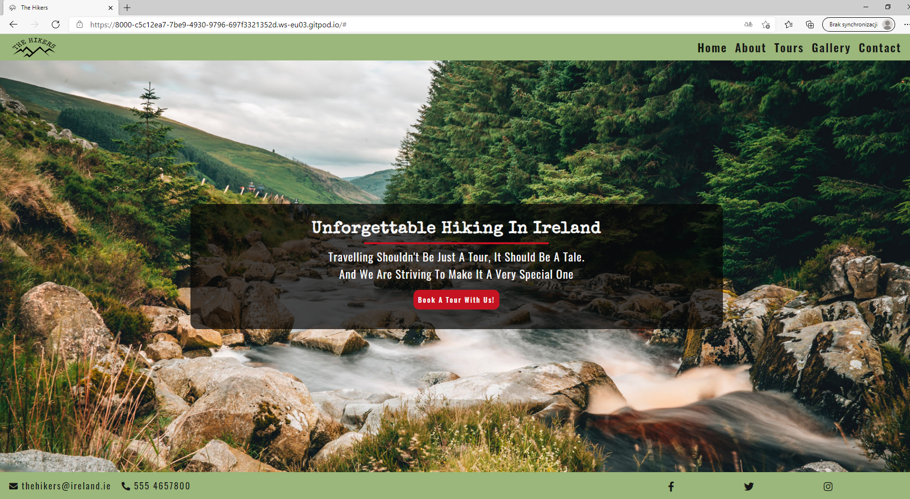
---
## Testing Performance
---
Performance has been tested using Lighthouse tool of Google Chrome. The results were a little bit different every time due to device performance and value estimation .
The results on the end were satisfying for desktop devices bit performance of mobile devices need to be revieved and tested again. There were some issues which needed to be fixed:

-  **Test for desktop devices**
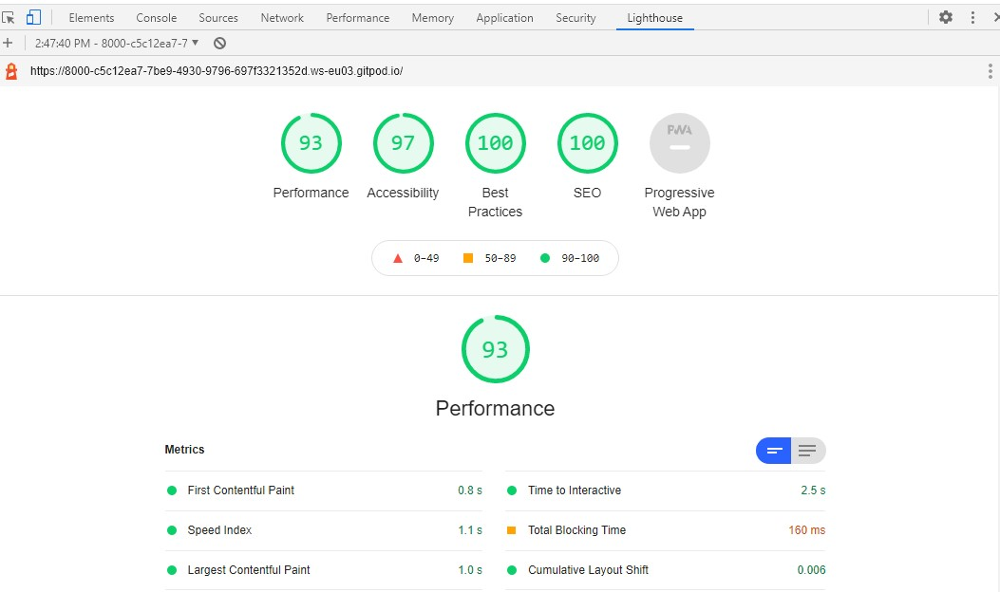

- **Test for mobile devices**

1. Properly size images
FIXED: by resizing in photoshop ans compressing images in [tinyPNG](https://tinypng.com/)
    - forest-mobile.jpg 
    - hero-image-mobile.jpg
    - happy-girl-mobile.jpg  
    - wicklow.jpg
    - about-team.jpg
2. Image elements do not have explicit width and height
FIXED: by adding width and height for images in index.html
3. Background and foreground colors do not have a sufficient contrast ratio
FIXED: checking on the [contrast checker](https://webaim.org/resources/contrastchecker/) contrast of colors for navigation bar and footer colors changed 
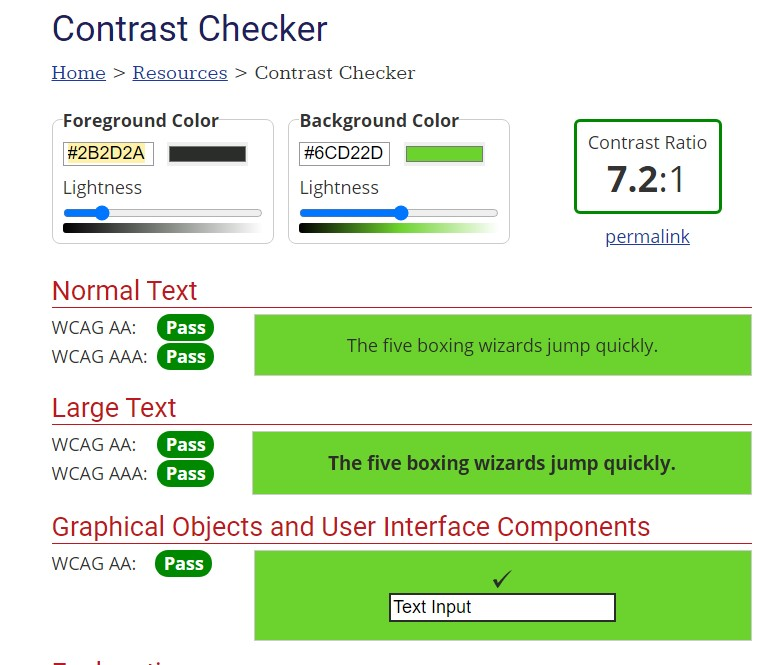 and new navigation bar and footer

**ADITIONAL TESTING through the project development**

After changes I've made in the project, considering advice from other users and from 
the peer-code-review, the website was tested again on Lighthouse. 
The tests were run multiple times and the performance scores varied considerably. 
Tests on desctop devices came out much better than on mobile devices.

- **Test for desktop devices**
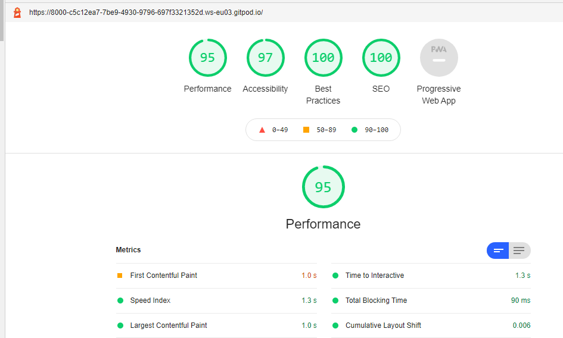

- **Test for mobile devices**
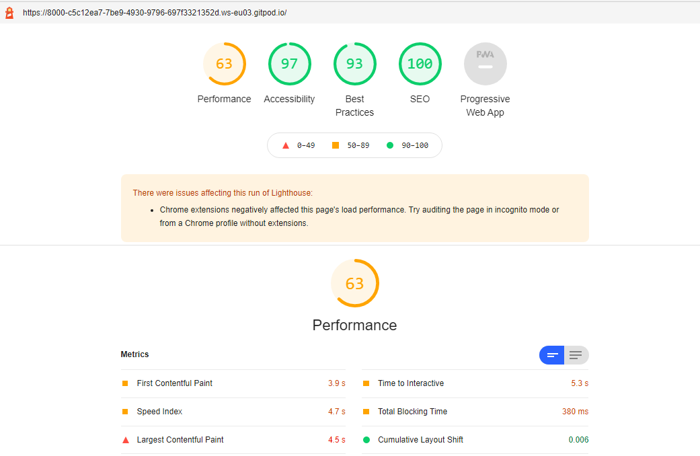

Errors that I've corrected:
- **Properly size images**
The photos were previously scaled down in Photoshop and compressed in TinyPNG, but the larger ones I reduced once more and compressed again

- **Image elements do not have explicit width and height**
Set the `width` and `height` attributes for the whole gallery in index.html 

Tests performed after changing the background-images code
-  **Test for desktop devices**
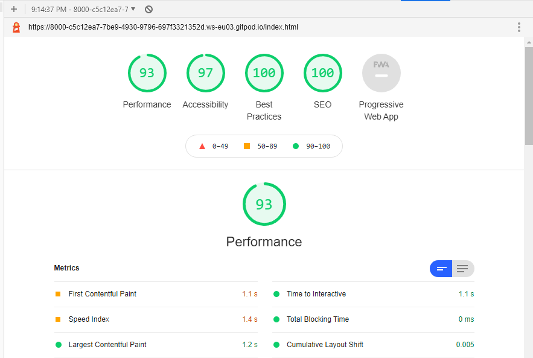

- **Test for mobile devices**
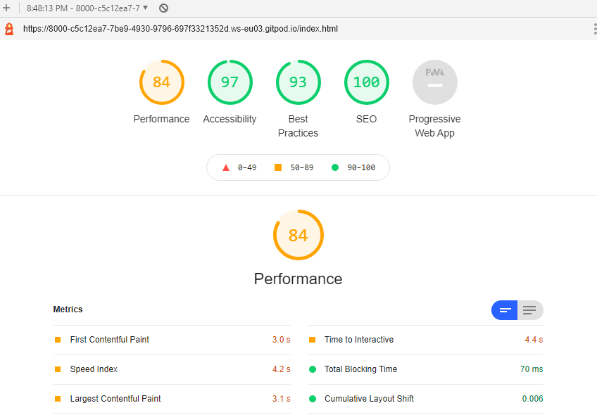

## Testing Accessibility
The website's accessibility was also tested using Lighthouse. The result was satisfying.

## Further Testing
### Overflow
- The website was tested for overflow using [Unicorn Revealer](https://chrome.google.com/webstore/detail/unicorn-revealer/lmlkphhdlngaicolpmaakfmhplagoaln?hl=en-GB) chrome extension. 
- Spelling was checked thoroughly using [Grammarly](https://app.grammarly.com/) extention and [online-spellcheck](https://www.online-spellcheck.com/)

